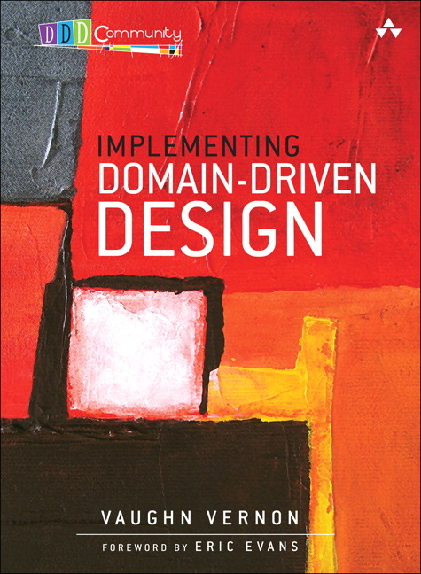

<figure class="float-left" style="width: 240px">
  
  <figcaption>Implementing Domain-Driven Design, Vaughn Vernon</figcaption>
</figure>

## Summary

In this book, Vaughn Vernon builds on top of Domain-Driven Design, Eric J Evans in order to provide the reader with a deep understanding of what is a Domain-Driven Design, how to implement it and why or why not choose this. The book is built in order to mix both technical sections and higher level ones about how to define and understand the business you are evolving in.

## Detailed notes

### Introduction

The two pillars on which a Domain-Driven Desgin is built are:

- Ubiquitous Language: shared team language, from code to business.
- Bounded Context: conceptual boundary around a whole application or finite system.

### Chapter 1 - Getting Started

Avoid *anemic domain model*!

It misses most of the benefit of a domain model. It is likely just a data model. A domain object is not a data holder.

Methods should have a clear purpose so that they are easy to test and easy to understand (both about what they are doing and when they should be used). You should not have to look too far away from the code to understand that (e.g database constraints or clients of the application).

You should expose the behaviors of an object not the shape (data attributes) of it.

### Chapter 2 - Domains, Subdomains and Bounded Contexts

Know your domain, subdomains, bounded contexts.

Ideally one subdomain per bounded context?

| Problem space                             | Solution space  |
|-------------------------------------------|-----------------|
| Core domain and its supporting subdomains | Bounded context |

Good to have one to one mapping for clearer separation but not absolutely necessary, one subdomain can intersect with several bounded contexts.

Bounded context is primarily a linguistic boundary.

### Chapter 3 - Context Maps

Drawing a context map before starting to see the relation (upstream/downstream) between the bounded contexts (including ones outside of the project). Start with current state, not future one.
Often good to keep an anticorruption layer between upstream dependency and your domain.

Be careful for your representation not to reflect the domain of your upstream dependency but your own domain! You don't have to take all the properties sent to you!

### Chapter 4 - Architecture

Always look for the clear justification of an architecture or architectural pattern used (what risks it mitigates for the project/business). If there is none, drop it.

**Layer architecture:** design where each layer is cohesive and depends only on layer below it.
Strict layers allow dependency only on layer just below. Relaxed layers allow to any layer below. Example of layers with DDD, from top to bottom: UI/Presentation, Application, Domain, Infrastructure.
Lower levels can be loosely coupled through observers or mediators. (example, interface defined in lower layer and implemented in higher level. Then passed to lower layer as the interface object).

**Dependency Inversion Principle (DIP):** High-level modules should not depend on low-level modules. Both should depend on abstractions. Abstractions should not depend upon details. Details should depend upon abstractions.

**Hexagonal (/Ports and Adapters) Architecture:** shift from *frontend/backend* view to circular (hexagonal) one with inside/outside relationship. The domain and application is inside and any adapter can be plugged around it to add a connection either as input (db) or output (API). Each side of the hexagon is a port where some clients are plugged.

Examples of ports: HTTP, messaging queues, …

**Service-Oriented Architecture (SOA):**

| Service design principle    | Description |
|-----------------------------|-------------|
| 1- Service Contract         | Services express their purpose and capabilities by means of a contract in one or more description documents |
| 2- Service Loose Coupling   | Services minimize dependency and only have an awareness of each other |
| 3- Service Abstraction      | Services publish only their contract and hide internal logic from clients |
| 4- Service Reusability      | Services can be reused by others in order to build more coarse-grained services |
| 5- Service Autonomy         | Services control their underlying environment and resources to remain independent, which allows them to remain consistent and reliable |
| 6- Service Statelessness    | Services place the responsibility of state management on consumers, where this does not conflict with what is controlled for Service Autonomy |
| 7- Service Discoverability  | Services are described with metadata to allow discovery and to make their Service Contract understood, allowing them to be (re)usable assets |
| 8- Service Composability    | Services may be composed within more coarse-grained services no matter the size and complexity of the composition they fall within |

**Representational State Transfer (REST):** each URI should point to one resource. Stateless communication. HTTP verbs do not translate to CRUD, it is common to have resources encapsulating behaviors. GET, PUT, DELETE are idempotent. RESTful server enables the discovery of related resources (links in the response). Hypermedia As The Engine Of Application State (HATEOAS).

**Command-Query Responsibility Segregation (CQRS):** Every method should be either a command that performs an action or a query that returns data to the caller but not both. 
Query model (one table per view for example) and Command model. One modification to the command model must lead to eventual consistency (synchronous or not) of the query model.

**Event-Driven Architecture (EDA):** can be a good way to deal with long-running processes. Be careful, if several events are sent in different directions and then need to wait for several actions to process we need to be able to associate the corresponding resulting events together in case several processes were started in parallel.

**Event sourcing:** get more of tracking than just an audit log. Ability to know at any point in time what was the state, temporal model. Store events that give the state when replayed in the same order (that's what is done by the repository there). Event sourcing without CQRS is quite rare.

**Data fabric and grid based distributed computing:** replicated cache shared by several nodes to enable distributed processing.

### Chapter 5 - Entities

DDD Entities should not just be a mass of getters and setters.
If the data is not crucial to keep entity might not be the best. CRUD approach could be better and simpler.

Id can be generated in a lot of different way but uniqueness has to be guaranteed... otherwise our core data is compromised.
Readability of ids can help both debs understanding what objects are moving around and business parts (think CS/ops) to deal with issues.

Careful if using db sequence as id. Can affect performance or need to cache values but then would lose some at restart. Need to assess if ok.

To distinguish, early identity generation (before entity is persisted) and late identity generation (when entity is persisted)

Hibernate for example is quite strict with ids and wants to use db native ones. To decouple ourselves form that we might need to use 2 types of identities one for the domain and one for the persistence. The persistence one is the surrogate identity.
Domain identity doesn't have to be the db identity. But then the surrogate identity should be hidden for clients not to be confused (private accessor methods).

Some entities might be better off hidden from the clients and just used internally. Others will need to be queried for business purpose and have to be exposed for sure.

*Note: MySQL has a maximum row (not column!) width of 65,535 bytes. Doesn't apply to TEXT and BLOB as they are stored in separate segments.*

### Chapter 6 - Value Objects

Domain should be centered around values not entities (meaning even entities should be centered around their value side).

<figure>
  <blockquote>
    
Values type that measure, quantify, or describe things are easier to create, test, use, optimize and maintain..

  </blockquote>
</figure>

When you care only about the attributes of the model, it should be a value and considered immutable.

Values should probably not reference an entity as if the entity change that would make the value change.

Value can (and should) have methods but they should be side effect free (immutability). So if you need to modify the value in the method just return a new instance. Also be careful if entities are involved… Probably safer to return an object that the entity can they use to modify itself.

If you're value looks similar to a basic language value, you may not use a specific Value, but it is also not very risky. And if you use a basic language value, you won't be able to add any specific method yourself...

You will need standard types to describe your value. Enum are a nice way to handle them. It can be done with the state pattern. Each state having methods describing itself (isStateA() -> true) and default implementation returning false for all.

Don't let your data model influence the domain model. It should be the opposite. Due to data model you might need to store a value object in a specific table for example. That doesn't mean it has to be considered as an entity!

If you have to store a list of values, it can be constraining to have them in the same row as your entity (classic way would be a string but they have length limit). Then it's a sign you would need them as entity on the data model level but that should still not influence the fact they are values in the domain model.

### Chapter 7 - Services

If something doesn't fit as a method on a entity, aggregate or value, then definitely a service exposing method using the ubiquitous language to do what you wanted.
Especially makes sense if during the execution you need several of these objects.

Be careful not to put everything in services or you'll end up with an anemic domain model.

Services can need an interface if you need several implementations. Then the interface lives in the domain and the implementations of it can live somewhere like in the infrastructure module.
If you name the implementation InterfaceNameImpl, it could be a hint there is need only for one not specific implementation and so no need for the interface.

If your service instantiate a domain object as a response, it definitely should not be an application service but a domain one.

Tests should show how to use the service both in happy and unhappy flow.

### Chapter 8 - Domain Events

Domain events capture an occurence of something in the domain.
For some commands they execute, aggregates should emit a domain event (named as the past of the command) containing the relevant information about the command executed.
Don't expose the domain events to the messaging infrastructure level!
The publisher lives in the domain module. The subscribers can live in the application services as it is usually the direct consumer of the domain.

The subscribers happen in the same transaction as the original application service. Don't modify another aggregate in them as it would then modify 2 aggregates in the same transaction (usually bad sign).

Subscribers can forward the event further (other bounded contexts) through messaging systems if this is required. The delay it can introduce in consistency has to be agreed on, the system might never be overall consistent at a given point of time.
Though the persistence store used by the domain model and the messaging system should always be consistent. Otherwise no guarantee to send all messages of actually persisted actions.

Never underestimate the latency which can be tolerated between consistency, but do discuss it clearly with other teams and/or domain experts.

If events are stored in a event store they can then be exposed in different ways either REST or still through messaging systems. Example for REST way is a chained list of logs of a given size, one current and some archived ones. The current becoming archived as soon as full (and new empty current is then generated).

When possible try to make action executed by subscribers/listeners idempotent, that way in case of duplication everything is fine without much need of de-duplication logic.

### Chapter 9 - Modules

Name your modules using the ubiquitous language, they should *tell the story*. There should be low coupling between different modules.
Typically one module contains a few aggregates that are related at least by reference.
Do not do one module per type (aggregate, services, factories, …). It would defeat the purpose, do use submodules to create coherent independent gatherings.
If there is a dependency between 2 modules, try to keep it unidirectional.
Be mindful of separation, depending of the relationship between objects, splitting into modules might not be what you want but actually they could be objects from different bounded context. Do not split bounded context too lightly though, it has to make sense and be of a clear value.

### Chapter 10 - Aggregates

When designing aggregates, keep in mind the pros and cons of bigger vs smaller ones. Smaller ones could help solve concurrency issues but be less convenient to use.

Rules of thumb:

- Model true invariants in consistency boundaries. (This is about transaction consistency).
- A proper Bounded Context modifies only one aggregate per transaction.
- Design small aggregates.
- Don't abuse of entities in aggregates, most os the time just having value-types properties can work.
- Reference other aggregates by identity.
- Use eventual consistency outside of the boundary. (If it is the job of the user executing the task to make the data consistent, make it transactional, if it is the job of another user or of the system, make is eventually consistent, aka asynchronous).

Acceptable exceptions:

- User interface convenience. (Example with batches of creation).
- Lack of technical mechanism.
- Global transaction.
- Query performance.

To find correct aggregates sizes, also consider calculating the costs of the different alternative for both the most common cases and the worst ones.

**Law of Demeter:** *principle of least knowledge*. Any given method should only invoke methods on: itself, a parameter passed to it, an object it instantiates or a self-contained part object it can access. It should never know more than the publicly exposed methods of what it can access.

**Tell, Don't Ask:** objects should be told what to do using the commands they expose.

Avoid dependency injections of a repository or domain service in an aggregate.

### Chapter 11 - Factories

Factories can be used in order to extract the responsibilities of creating complex objects or aggregates.
One aggregate could have factory methods named as actions (done by the user) which create another object held by the aggregate.
The caller would then have to make sure to persist that new object return by the factory.
Factories can also live in domain services, converting date from one type to the desired one.

Keep in mind for simplicity that factories don't need to have guards already in places in the constructors they use.

### Chapter 12 - Repositories

Only aggregates should have repositories, but all of them should have one.

Collection-oriented repositories do not hint anything about the persistence mechanism in the way they are designed. The vocabulary of methods will be about the same which is used for collections in Java (add/remove rather than save/delete). The most similar would be the hashset.
One key part is that you should not need to add objects which are already added. And doing so should result of no change. You should also not needed to *re-save* them.

Always implement repositories with an interface and at least one implementation. The interface should be in the same module as the aggregates that it stores.

Persistence-oriented repositories are a bit more flexible in the sense that they can work both with object-relational mapper and key value stores.

Implementation of repository makes sense to have in the infrastructure layer.

Lazy migration approach, keep old name in db but use new one in model and always convert the name when storing/retrieving.

A repository should mimic as closely as possible a collection (think about using method name *size* instead of *count* for example).

Complex finders *use case optimal queries* or ok, but if you have too many of them, it might be that the aggregate is mis-designed.

Transactionality should be addressed in the application layer not in the repositories.

⚠️ A repository is not a DAO.

### Chapter 13 - Integrating Bounded Contexts

Integration between bounded contexts can be done through several ways:

- Exposing an API
- Publish/subscribe messaging
- REST HTTP API
- ...

Principles of Distributed Computing:

- The network is not reliable.
- There is always latency, and maybe a lot.
- Bandwidth is not infinite.
- Do not assume that the network is secure.
- Network topology changes.
- Knowledge and policies are spread across multiple administrators.
- Network transport has cost.
- The network is heterogeneous.

Whenever integrating two bounded context, be careful not to use feature from on into another and shield your domain against changes in the other one (anti-corruption layers).
In case of events you can try to define a generic structure for the base and then more specific one for the actual payload. The base will be known by the consumers and stable and the payload would be likely to evolve with time and should ideally not break clients when doing so. If no interface is exposed, clients might even manage not to have to update any dependency and recompile/redeploy.

If using messaging, always keep in mind that the order of delivery might (will?) not be the same as the order of sending.

If long running processes rely on messaging, it is probably better to have a tracking/retry/failure mechanism to handle the different possible outcomes gracefully.

### Chapter 14 - Application

The domain is usually there to enable the features of an application. Meaning a coherent mixture of User Interface, Applications Services, Domain Model and Infrastructure organized given a specific architecture.

#### User Interfaces

To render data in the UI you can use DTOs. Be careful not to couple too much client and domain doing so. The building of the DTOs should probably not imply deep navigation of the domain.
Other option: Mediator (or Double-Dispatch and Callback) interfaces.
A possible improvement of DTOs are Domain Payload Objects (DPOs), which gather several aggregates in one object.

Build representation for the use cases, not based on your domain.

To decouple more easily it can be convenient to use a presentation model.

#### Application Services

Direct clients of the model. Place where the db transactions and security are controlled.
Keep application services thin and use them only to coordinated actions on the model.
Applications services can shields completely the presentation from the domain but it's not a necessity. If they do so the presentation would call them using primitives or command objects for example.

Applications services could either returns the domain object of their action or the DTO corresponding. They can also always return void and write the output to a generic port (hexagonal architecture mentality).

Sometimes the representation can compose different domains, that can be done in the application layer.

#### Infrastructure

Infrastructure should depend on the interface of the other parts (presentation, model, application) if it needs, but not import objects directly from there.

### Appendix - Aggregates and Event Sourcing (A+ES)

Event sourcing can be used to store any modification done to an aggregate and then build the aggregate by replaying the story of these modifications.

Read model projections can be used to calculate query results on each domain event and store them in a specific read model.

Rule of thumb for domain events is to design them to satisfy 80% of subscribers even if it means having too much data in the events for most of the subscribers.

Empirical rule of thumb: no more than 5 to 7 property members in a class.
