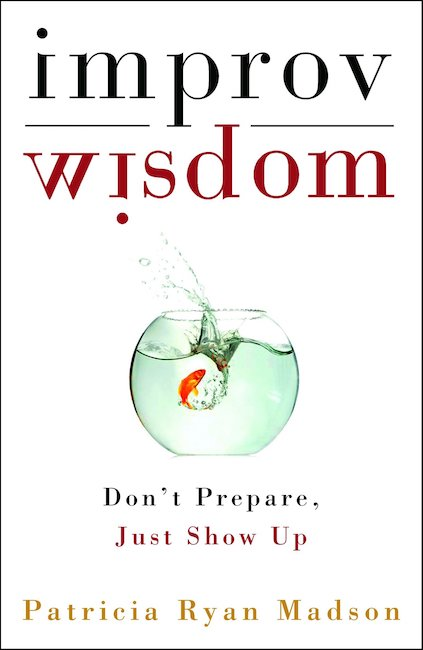

<figure class="float-left" style="width: 240px">
  
  <figcaption>Improv Wisdom, Patricia Ryan Madson</figcaption>
</figure>

## Summary
In the prologue, the author roots the philosophy of this book in both the improvisation world and the Japanese, or more broadly Asian, philosophies of life. In particular, Keith Johnstone and his Impro, a reference text on improvisation and Dr. David K. Reynolds and his Constructive Living® principle are quoted as inspirations.
She also describe how this idea of taking the improvisation principles from the stage to the life outside came from her own experience and background.

Each of the 13 chapters is elaborating about one of the main principles called maxims.
Examples are provided from former student of the author who benefited from applying these maxims to their life.
They range from simply from enjoying life more, helping themselves getting out of a difficult period in life or thrive toward success.
The maxims' names have are rather provocative and catchy but of course they are not to be taken literally but as guidance.

## Main points
The 13 "maxims" mentiond in the book are the following.

### 1- Say Yes
This first chapter is a good example about not taking the maxim litterally.
"Say yes" is not about saying yes to *everything*, they are, of course, some things to which it would be unreasonable to say yes. But you are encouraged to take away from the book to at least say yes a bit more to what life brings to you and approach new ideas with a more open mind, even just a little more.
### 2- Don't Prepare
Try to give up a bit that common habbit to plan everything and instead pay full attention to the present moment and what is happening. Leave room for surprises and go with the flow.
### 3- Just Show Up
Go to the places where what you want to do is happening on time and it will happen. Build rituals and habits to make it effortless and not depend on motivation.
### 4- Start Anywhere
Don't wait for a good idea, take the first idea and make it a good one.
For a speech/presentation/class instead of detailed notes, write the questions to answer.
### 5- Be Average
Don't always try to be unique or differentiate yourself. Just be natural and who you are even if it sounds classic or dull.
### 6- Pay Attention
Pay attention to the present moment, the palce you're in, the people you're with. Even go to details, what colors are there, who is wearing what. And then try to remember it later on. A meaningul small example which can make a different is about remembering faces and names.
### 7- Face The Facts
Don't try to live in a world which is not reality, accept it and embrace it. Flaws and imperfection are normal, in things and people. But also make sure to recognize as facts all the positive points.
### 8- Stay On Course
Be sure to have a purpose. It will guide your improvised decisions to the right direction. If the goal is not getting closer or causes bad decisiosn, reconsider it.
### 9- Wake Up To The Gifts
Remember to question if what you consider "normal" or expected is actually a gift from someone or sometime just luck. You can never thank people enough, say "thank you" even for small things if you think they are nice.
### 10- Make Mistakes, Please
Less planning and more improvising will of course cause mistake. Learn from them, don't overthink them. Acknlowdge and recognize them and then move on and keep going! To go forward, you have to take risk and sometime it will fail.
### 11- Act Now
Do things, alone from a schedule or with someone to motivate each other. Get started and solve the hard things first, continuing with the easy ones will be even easier afterwards.
### 12- Take Care Of Each Other
Always support the people around you, make them feel and look good, they will almost always give that back to you as well. Don't calculate, give "random acts of kindness". Do more than expected, un-prioritise your own convenience.
### 13- Enjoy The Ride
Smile, laugh and enjoy. If you don't enjoy what you're doing, you won't keep doing it for long. So, if you want to keep doing it you have to enjoy it one way or another. You can learn to like things, it doesn't have to be natural.
 