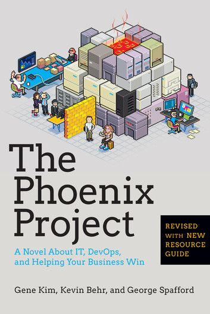

<figure class="float-left" style="width: 240px">
  
  <figcaption>The Phoenix Project, Gene Kim, Kevin Behr, George Spafford</figcaption>
</figure>

## Summary

Agile seems to be more and more the norm in term of  software development, especially in smaller companies.
So if you're used to this way of working, the book is not likely to bring too much new direct knowledge to you.
The novel format prevents it to go too in depth about some aspects.
It can definitely be a good reminder about where the idea comes from and a great source of comparison and inspiration about how to introduce and explain this topic to people who are less familiar with it.
It is also a rather easy and quick read.

## Detailed Summary

### Context

Parts Unlimited is a company selling automotive parts.
Software development and operations are not their core business at all but really just a tool to empower teams working on the sales and making them more efficient.
As they go through a hard time in term of business, all their hopes rely on a new software which is supposed to improve a lot how they can interact with their customers and target them.
However, with the state of the tech teams in the company, it as little chance to be delivered in time or even delivered at all.
Under the lead of Bill, advised by Erik, the IT operations processes and ways of working will be transformed from an old fashioned slow structure to a more Agile approach with even some hints of DevOps coming as the next step.

### Characters

- **Bill**, newly appointed VP of IT Operations (aka infra).
Former Director of Midrange Technology Operations (legacy mainframe infra it seems).
 He  is  the main character and will have to figure out how to make the Operations department run more efficiently and collaborate better with others.
- **Wes**, director of Distributed Technology Operations.
He is the main  link between operations team and Bill in the book.
First hands on deck to deal with issues and pass on new ways of working to the team.
- **Patty**, director of IT Service Support.
She mostly helps with all the organizational aspect, how to put processes in place and make everyone more efficient.
- **Chris**, VP of Application Development.
As the lead of development, his interactions with Bill show the evolution of the feedback loop between the two departments and their relationship overall.
- **Steve**, CEO, acting CIO.
At first mainly concerned by the business or product aspect of the company, he learns to understand the software part of it and how it is critical to the company's performance.
- **John**, Chief Information Security Officer (CISO).
Here to show how security can abuse other division based on the fact that "it is important" and then after a big transformation from the character how a better way to deal with it is for security to look for achieving its goals while adding the least amount of work possible to  others.
- **Erik**, presented as a potential new board member, he is the source of wisdom in the story.
He gives advices to most of the character in this list introducing the types or works and "ways" by taking as an example and old fashioned factory production line.
- **Brent**, lead Engineer.
One key asset of the company, he seems to be the only guy knowing about a lot of things internally and often the only one able to do some changes or fixes.

### Main points

The mains advices givens by Erik are based on old fashioned production lines and how software development and operations can actually be much more similar to it than most people like to think about.

He bases his advice to Bill on the following concepts.

#### The 4 types of works

- Business projects
- Internal IT projects
- Changes
- Unplanned work or recovery work

I'm a bit skeptical about the "Changes" category as any change is likely to come from on of the other categories, so it feels more to me like a classification of tasks than a type of work as "reason why some work is done".

#### The 3 ways

_The First Way_: Optimizing the production flow from development to release.
It boils down to nowadays rather common principles like continuous build/integration/deployment.
To improve this flow, always focus on the bottleneck first otherwise any speed improvement is pointless.
One interesting side point mentioned is identifying what are the actual changes which can provide the best value for the company at a given point based on the business context and goals.
Because any other change is a bit like a change getting stuck in a bottleneck and rather pointless.

_The Second Way_: Creating fast feedback loop in the flow so that any downstream issue can soon be addressed (tests, strong cooperation between IT ops and dev).
There area few goals here.
Identifying the errors as early as possible in the flow to fix them at the source rather than patch them much further down.
Recognizing the value of prioritizing improvements of the flow over regular feature work.

_The Third Way_: Encouraging a culture of continuous experimentation and learning from the experimentations (either success or failure).
Dedicated time can be planned for non functional requirements.
One way to make people confident with these experimentations is to make it clear that failures and risks are ok in that context and won't be blamed.
As well as making it safe to fail (one failure won't take the whole system down).
Independence of people and teams in how they work and organize their work also help them get the freedom and inspiration to try things out.
