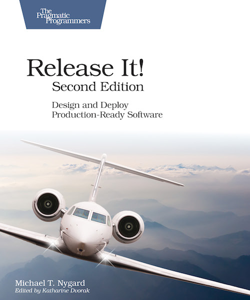

<figure class="float-left" style="width: 240px">
  
  <figcaption>Release It!, Michael T. Nygard</figcaption>
</figure>

## Summary

If you've been in a company developing a micro-services architecture with rather modern tooling and processes around it, this book might not bring too much new information to you.
It mostly goes over principles which are now broadly considered as rather standard, while staying at a rather high level and just pointing towards some tools or names to investigate in more detailed way if you're interested.
It can still be a good reminder on some core principles once in a while though.

If you are in a more established company having a bit of hard time to modernize its practices, this book can be a very good tool to get a few cases likely to resonate with internal issues and how these practices or design decisions can help make the situation better and often save money or enable better growth in users and revenue.

## Detailed Summary

### Chapter 1: Living in Production

An application or service is useful only when running in production.
This is when it is fulfilling its goal and generating value and revenue for the company.
In this there are two conditions, that it is "running", as opposed to being down, and "in production", as opposed to being developed.
Any of them alone would be relatively easy to achieve, but together they define a set of constraints which makes the challenge of nowadays software development.
How to increase the speed of development (bringing new features in production faster), while decreasing the time the service is disrupted or down (keeping the service running as expected)?
The book focus mostly on the maximization of uptime in production, though it has to touch a bit to the deployment for it as well.

## Part 1: Create Stability

### Chapter 2: Case Study

A rather typical example about how an apparently small issue ended up causing a major downtime because of a combinations of unlucky factors and robustness not being baked in the system.

### Chapter 3: Stabilizing your System

Systems go through various lifecycles and states over time.
Defining what is the stable state of one system can be more complicated than it seems, but it is what will allow you to evaluate if your system is stable or not.

Overall one system should be able to run for an indefinite amount of time (look out for memory leaks typically...), endure different levels of traffic, start and stop in a clean way and mitigate the propagation of its failures.

### Chapter 4: Stability Antipatterns

Integration points are a very sensitive part to look at; they are weak by default.
Always assume the call will fail and plan accordingly so the failure doesn't propagate badly in the rest of the system (timeouts not to starve the thread pool for example).

A wide variety of issue can arise, from hardware low level ones to services or people not respecting standard implementations of some protocols.
When possible use well known, widely used and tested library to deal with your calls to external systems (being other services, databases, messaging systems or whatever).
Keep an eye on the thread pools for these, remember they can be slow or fail for any seemingly random reason.

### Chapter 5: Stability Patterns

A bit of the counterpart of *Chapter 4*.
In order to make your integration points a bit more secure, there are common methods to keep in mind.
It won't prevent calls to fail, but it will prevent these failures to propagate to the whole service or even more broadly.

Always use timeouts (and fail fast rather than waiting too much), consider circuit breakers, especially if you can use a relevant fallback.
Test your remote calls through a decent variety of failure around the typical faulty or slow responses cases.

## Part 2: Design For Production

### Chapter 6: Case Study

Example about how exceptional load changes (specific days for some industries or marketing efforts) will affect all the parts of your system even the ones which might usually be considered non critical and so prioritized a bit less in term of resources.
IF they are still somehow part of any chain in the process, especially if synchronous, these are the ones which will fail first and might bring everything else down with them.

### Chapter 7: Foundations

Review of the networking and hosts allowing the services to run.
Three main level:

- Physical hosts
- Virtual machines
- Containers

Any of these can add some networking abstraction, and change how exactly a machine is designated.
But moving towards containers can help not having to solve too much of it for yourself.
One main aspect around networking for developers is to keep in mind "names" are mostly variable so always use something not too tightly coupled with the current network.

### Chapter 8: Processes on Machines

To run a process (aka service), you first need to write the code for it, but that's almost the easy part.

For the configuration, be careful about any sensitive data (passwords/secrets...) as you can consider over time someone somewhere will have access to these while they shouldn't.
In the world of containers spend some time considering what should live as configuration with your service and what should come from outside as environment variables.
For example if you want to keep passwords fully unknown from developers and managing the encryption centrally, they might be better of coming from the environment.

To know if you process runs then, you need a bare minimum of visibility, usually logs...
Keep in mind if you store logs on the machine where the process runs or any other machine, that it will run out of space at some point.
Logs also can get much more useful if gathered together with logs of other processes and correlated together through some id or tags.
Be careful about any sensitive data making their way through logs as well as these can easily end up shared between people or sent to third-party services.

### Chapter 9: Interconnect

In order to make the most out of independent processes you will need to connect them.
The best solutions for that can change depending your scales, though tools like Kubernetes, Consul or even hosted solutions on AWS or Google Cloud enable even small teams to go with solution previously reserved to large companies with dedicated platform teams.

The simplest solution at small scale could be to keep a static DNS record of your services, if you have few of them and they don't move much, it's still manageable.
As that grows you will need to look into service discovery tools or service mesh ones in order to keep up to dates records of the available instances to call.

You will also need solutions in order to balance the load between several instances of a given service, there is no value having several instances if all the traffic goes to one...
That can range from hardware load balancer to client side load balancing.

A few points to keep in mind around these problems.
If any of the solution you pick puts responsibility on the service itself to do something, it will have to be implemented in all fo your services, and then the day it changes, same again.
So you might want to consider tools which live next to your services and just use generic information exposed by them to build the records they need.
For example using services health endpoints.

One trick around that is to define when a service should present itself healthy.
Is it when it has started, when it can reach a given database, a given upstream service...
It will depend on what are the critical requirements of your service mostly.

### Chapter 10: Control Plane

In order to have all the above you need some platform to make it run.
With the companies out there nowadays and the services they offer, it is probably not worth it for you before a long time to invest heavily with a specific platform team in your company.
Rather spend time evaluating the existing options and pick the one suiting your needs the best.
Do encourage your engineers to dedicate some time to this and to experiment.
Keep in mind the tradeoffs between going full on with one provider (it can make some things easier or give more powerful results) and trying to be more provider agnostic to avoid or limit the lock-in effects.

Once you have all the previously mentioned aspects, you need to make sure they keep running correctly.
You will need tools for monitoring the services and the infrastructure tools allowing all that to operate.
Some key indicators to keep an eye on:

- Traffic indicators
- Business transactions
- Users
- Resources pool health
- Database (and database connection) health
- Data consumption
- Integration point health
- Cache health

You can find all the usually complicated area to manage, and that's for a good reason.
Something will go bad with some of these.
So the fastest you can see it, the best it is.
For the metrics mentioned, display some overall values and then some success/failures specific ones.

### Chapter 11: Security

Mostly going over the OWASP top 10 security risks list from 2013 providing concrete examples about the risk they can involve for companies.
For the latest version of the top 10, see <a href="https://www.owasp.org/index.php/Category:OWASP_Top_Ten_Project#tab=Main" target="_blank" rel="noopener noreferrer">OWASP Top Ten Project</a>.
As for robustness, it also emphasize on the fact security needs to be continuously part of the process to have a chance to reach meaningful result.
It can't just be an occasional concern.

## Part 3: Deliver Your System

### Chapter 12: Case Study

Example of how long deployment with complicated sequence of actions to be taken by many people are likely to fail.
Even if they succeed, they are costly and inefficient.
More time and effort just gives your more confidence that you code runs in QA or whatever environment it is tested against, but as similar as you can make them, production will always be a different environment, so there will be risks anyway.
Release big bunch of changes, just increase the number of risks taken at once (and that doesn't increase linearly).

### Chapter 13: Design for Deployment

If you want to deploy small and deploy often the main conditions are

1. automated deployment
2. deployments causing no disruption to the production service and traffic

Assuming you have several instances of the same service running at any point in time (which is likely needed at least round the deployment window if you want to deploy with no downtime) there are a few problems causing extra work to have the deployment running smoothly.

A bit more of extra care (and code) is needed to make the version N+1 compatible with the version N and vice versa.
It is especially true if the deployment includes database or assets changes.

After the deployment don't forget to remove any of this transition code (yes that will be another deployment).

### Chapter 14: Handling Versions

*Chapter 13* touches the topic of compatibility between different versions inside the instances of a given service.
But potentially even more likely to break, depending the communication around changes, are the links between different services when any of them change version.
This is especially true in the micro-service architectures.

Think about communicating breaking changes, defining migrations plans and helping other teams apply them if needed.
A simple example can be a new version of the API introduced while still supporting the previous one for the time needed.

On the consumer side, put in place reasonable defenses in case on service you call starts to fail.
But that links back mostly to the topic of integration points in the early chapters.

## Part 4: Solve Systemic Problems

### Chapter 15: Case Study

Example of how, regardless of how much you can plan ahead in term of testing for a new system, it will always leave room for unexpected scenario.
Which leads to the idea of testing directly in your production environment which is the one with the widest range of scenario.

### Chapter 16: Adaptation

As hard as it can be sometimes, putting in production the initial version of a project is the easy part.
If you built a computing service for something it is because you will need it there for a long period of time, not for a unique use.
Over time the requirements and goals will change and any decision taken originally is likely to be challenged and even to end up being seen as a bad decision (it was likely not too bad at that time, but with the new information available you can judge the decision in a very different way).

There are mainly 3 levels where to look at to try to keep things flexible.

**The organizational level, how teams and processes are structured.**

Just like everything else, processes should be challenges and evolve, they should define a safety net above which teams can operate but not restrict their action and prevent change.
Processes should acknowledge the change of requirements and empower people to act in consequences, the best decision might be to shutdown a service, start a new one from scratch or spend the time needed to adapt the existing one.
Teams with all the resources they need internally can be more reactive to any change, they don't have to wait for a time, which is always too long, for another team to come back to them.
Think about DevOps for your engineers, think about having a platform teams building tools for everyone to deal with their platform issues rather than fulfilling demands from other teams.

**The service architecture level, how services are structures.**

Whenever possible consider if the change you are doing fits in the service you have or if it should be a new one.
The goal is to try to keep the services coherent and of a decent size so they remain easy to reason about.
One good point to consider when possible is asynchronicity, if the requirements can support it, it will leave more room for changes in the implementation and more options around scalability.
At a more abstract level, try to leave room for changes in the architecture decisions, don't force yourself in a direction which will be hard to change if you have a more flexible one with similar cost/benefit criteria.

**The data level, how actions are modeled.**

Data is tricky to adapt, any major change here will be painful, changing database type, changing the structure of the database, ...
any of these is a hard and lengthy process.
As we mentioned you probably can't foresee the future needed changes when you initially pick any technical solution, so just do as good as you can, but probably not worth overthinking it.
The main point around data is to keep all of it.
Don't throw away some piece of data because of outdated restrictions like space or network bandwidth.
What will change over time is the model you use to represent data, but the raw data will broadly remain the same, so just try to capture as much of it as possible to allow its use later.

### Chapter 17: Chaos Engineering

Chaos engineering can be seen like any type of testing.
It is just newer so not as commonly acknowledged as needed, normal and valuable.
But like any testing once reaching a given scale where stability is probably the most valuable aspect, any time spent on it will return big value.

Just like any testing, approach chaos engineering iteratively, learn from previous failures, see what kind of "test" could have caught the root cause (and yes it might be shutting down something not gracefully...), automate it and run it on a reasonable frequency.
Here a difference with more common types of tests like unit tests or integration tests is that the best way to run them might not be in the build pipeline but just periodically on production.
