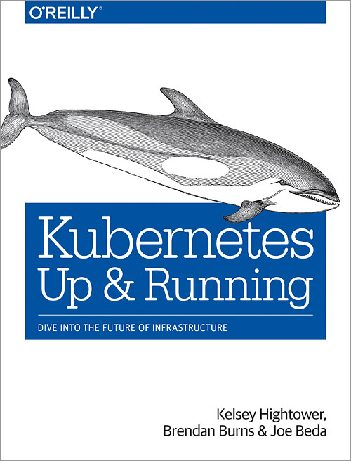

<figure class="float-left" style="width: 240px">
  
  <figcaption>Kubernetes Up & Running by Brendan Burns, Joe Beda and Kelsey Hightower</figcaption>
</figure>

## Summary

Kubernetes is the new default choice in term of container management tool. It has proven its capacity to solve a wide range of issues around autoscaling, automated deployment without downtime, high availability and speed of iteration. Moreover, the backing it receives from most cloud providers and other big tech actors as well as the wide community of developers who get involved gives it all the chances to stick around and get even better in the coming years.

This book is a great way to get to discover, understand and use the main concepts in Kubernetes while getting used to the specific way of thinking around infrastructure needed to make the most out of it. The examples are mostly basic setups, but they provide most of what is needed to get started. More resources can be found on the <a href="https://kubernetes.io/docs/home/" target="_blank" rel="noopener noreferrer">Kubernetes documentation</a>.

## Detailed Summary

### Chapter 1 - Introduction

Four main reasons to use containers and container APIs like Kubernetes.

#### Velocity

Based on the principle you want to ship new features while keeping high availability in order not to have losses coming from your deployments. These concepts help with keeping velocity.

- Immutable infrastructure: any change is applied by creating a new container image which remains accessible in the exact same state in the registry.
- Declarative configuration: Kubernetes job is to match the desired state describe by the configuration. You should not have to care too much of the actions taken for that.
- Self-Healing Systems: once the desired state is achieved, Kubernetes will also take action in order to maintain it over time.

#### Scaling your service and your teams

Thanks to decoupled architecture it is much easier to achieve independent teams and service cooperating through well defined APIs at different levels

- Pods = groups of containers = deployable unit
- Services adds load balancing, naming and discovery
- Namespaces provide isolation and access control
- Ingress objects can combine several services to a single external API).

Scaling is just a matter of specifying a number of instance and these instance can even end up using less resources than if you would have define them manually.

#### Abstracting your infrastructure

If you take a few extra step like not using cloud managed services and abstract specific storage implementations for example, you should be able to move a Kubernetes cluster from one provider to another or even self hosted or a combinations of these by just providing the existing config files to the new cluster.

#### Efficiency

Thanks to the isolation and automation, several applications can be packed on the same servers increasing the the usage ratio of the underlying hardware.
It reduces also a lot the cost of test environment as they can just be setup from the same config as prod. That enables new options to increase velocity while keeping a high level of confidence in the releases.

### Chapter 2 - Creating and Running Containers

Images are most commonly built based on previously existing images by just adding layers on top of it. For example you take a "system image" of a Linux distribution, add a given version of the JVM to it and then add your Java application. You can then run the application making sure it will always use this same JVM version packaged with it, and also reuse the image containing the JVM for any other application.
One thing to keep in mind is that one layer cannot "physically" change a previous one. For example if you remove a file which was created upstream, that file will still count as weight in the final image, it just won't be accessible in a straightforward way.
One you have the image you want, you would commonly host it on a docker registry to be able to fetch it from anywhere and then run it. When running the image you can define useful resources limit as show in this command example.

```bash
docker run -d --name <image-name> --publish 8080:8080 \
  --memory 200m --memory-swap 1G --cpu-shares 1024 \
  <image>
```

### Chapter 3 - Deploying a Kubernetes Cluster

To start with, probably better to use a hosted solution on your provider of choice.
Locally you can use _minikube_, but one limitation is that it only creates a single-node cluster, preventing most of the reliability promised by Kubernetes.

One the cluster created, you interact with it using the Kubernetes client _kubectl_. Some useful commands

```bash
kubectl version
```

Provides both the version of the _kubectl_ tool and of the Kubernetes API server, backward and forward compatibility is guaranteed only within 2 minors versions, so try to keep the update of these two rather close.

```bash
kubectl get componentstatuses
```

Runs a diagnostic on the cluster; useful to get an idea of the general health status of the cluster.

```bash
kubectl get nodes
```

```bash
kubectl describe nodes node-1
```

Gets the list of nodes and then gives details about one specific nodes.

```bash
kubectl get daemonSets --namespace--kube-system kube-proxy
```

Gives the list of proxies.

```bash
kubectl get deployments --namespace--kube-system kube-dns
kubectl get services --namespace--kube-system kube-dns
```

Gives the DNS and of the service performing the load-balancing for the DNS

```bash
kubectl get deployments --namespace--kube-system kube-dashboard
kubectl get services --namespace--kube-system kube-dashboard
```

Gives the dashboard and of the service performing the load-balancing for the dashboard

To access the UI `kubectl proxy` and http://localhost:8001/ui

### Chapter 4 - Common _kubectl_ Commands

By default _kubectl_ interacts with the default namespace, the `--namespace=<name>` flag can allow to configure that per command.

Default namespaces, clusters and users can de defined in contexts.

```bash
kubectl config set-context <context-name>
  --namespace=<name> \
  --users=<users> \
  --clusters=<clusters>
```

```bash
kubectl config use-context <context-name>
```

Any kind of object in Kubernetes is a resource and can be seen as we saw earlier for the `nodes`

For a list

```bash
kubectl get <resource-name>
```

For a specific object

```bash
kubectl get <resource-name> <object-name>
```

Useful flags to get correct output `-o wide | json | yaml` or `--no-headers`
Querying specific fields can be made with `--template={.status.podIP}`
The flag `--watch` keeps the get command running and update the output if the list of objects or the state of some of the objects change.

For details about an object

```bash
kubectl describe <resource-name> <object-name>
```

To create or update an object, define the desired state in JSON or YAML file and run

```bash
kubectl apply -f object.yaml
```

You can edit a config in an interactive way with

```bash
kubectl edit <resource-name> <object-name>
```

But it should probably be used only for testing purposes since you lose most of the checks and tracking the file editing in a versioning system would provide.

To delete an object

```bash
kubectl delete -f obj.yaml
```

or

```bash
kubectl delete <resource-name> <object-name>
```

But it goes on without confirmation, so to use carefully!
Even more carefully you can delete all instances of a given resource

```bash
kubectl delete <resource-name> --all
```

To add a label

```bash
kubectl label <resource-name> <object-name> <label-name>=<label-value>
```

To remove a label

```bash
kubectl label <resource-name> <object-name> <label-name>-
```

Debugging commands seem similar to Docker ones

```bash
kubectl logs (-f) <pod-name> (-c <container-name)
```

The `-c` flag is useful if several containers run on the same pod.
The `--previous` flag will get the logs from the previous instance of the container. In case of unexpected shutdowns, it can be useful to investigate.

Execute a command in a running container

```bash
kubectl exec -it <pod-name> -- bash
```

Copy files from a container with

```bash
kubectl cp <pod-name>:/path/to/file /local/path
```

Reverse the syntax to copy to the container

See `kubectl help` for more details

### Chapter 5 - Pods

A _Pod_ is the atomic unit in Kubernetes, it is a group of Docker containers. Everything in one _Pod_ execute in the same environment, for example they share the same IP address, port space, hostname. They also always will run on the same machine.
If two containers are in different pods, they can be on different servers as far as you know.

To decide what to put in one Pod, the useful question is
> "Will these containers work correctly if they land on different machines?"

If the answer is no, then they will have to be on the same Pod, if the answer is yes, you can happily decouple them and put them on different pods.
For a typical example, a database doesn't need to be on the same _Pod_ of the application using it, you just need to indicate to the application where the database is located. But if you have several containers needing the same filesystem, they will *have to* be on the same pod.

You define Pods in a _Pod_ manifest where you configure the desired state, following the _declarative configuration_ advocated by Kubernetes.

When you submit a _Pod_ manifest to Kubernetes, it gets persisted on the etcd storage. The scheduler places Pods which aren't already schedules on nodes with enough available resources (favoring different nodes for different instance of the same application for reliability).
To manage multiple instance you can submit several time the same _Pod_ manifest or use _ReplicaSets_ which will be explained later.

Creating a _Pod_ (through a deployment) can be done with

```bash
kubectl run <pod-name> --image=<image-name>
```

But the normal way would be to create a _Pod_ manifest in YAML or JSON and make Kubernetes apply it with

```bash
kubectl apply -f config-file.yaml
```

In order to access a _Pod_ you can forward one of its port to a port of your machine with

```bash
kubetctl port-forward <pod-name> <loalhost-port>:<pod-pord>
```

Kubernetes defines two types of health checks for a Pod, Any of them can be `httpGet`, `tcpSocket` or even `exec`.
The _liveness probe_ is used to know if a container is healthy. If it fails this probe, the container will be restarted.

The _readiness probe_ is used to know if a container is ready to accept traffic. If one container fails it, it gets removed from the service load balancers.

In a _Pod_ manifest you can define how much resource each container needs and should be given. Two different types of configuration exist and the Pod's resources will be the sum of its containers' resources.
The `requests` are the resources the container should always have. The container will not be put on a server with less than these resources available.
The `limits` are the maximum resources the container should ever be allocated. If left undefined, the containers running on a machine will be allocated evenly all resources of the machine until more containers are scheduled to run there and request some of the resources.

If you need to persist data from a _Pod_ over containers restarts you will need to access some kind of persistent storage, it is done through `spec.volumes` and `spec.containers.volumeMounts` in order to map the mounted volume to a path for the container.
This can be used for sharing data across containers, persisting a cache which should survive restart of the container (not pod) (with `emptyDir`), actual persistent data on remote disks to be able to access it wherever the _Pod_ is scheduled next (with `nfs` for example), or access the host filesystem with `hostPath`.

Based on the previously mentioned concepts the _Pod_ manifest would look something like the following file.

```yaml{numberLines: true}
apiVersion: v1
kind: Pod
metadata:
  name: <pod-name>
spec:
  volumes:
    - name: "<volume-name>"
      nfs:
        server: my.nfs.server.local
        path: "/path"
  containers:
    - image: <image>
        name: <image-name>
        ports:
          - containerPort: 8080
            name: http
            protocol: TCP
        resources:
          requests:
            cpu: "500m"
            memory: "128Mi"
          limits:
            cpu: "1000m"
            memory: "256Mi"
        volumeMounts:
          - mountPath: "/path"
            name: "<volume-name>"
        livenessProbe:
          httpGet:
            path: /healthy
            port: 8080
          initialDelaySeconds: 5
          timeoutSeconds: 1
          periodSeconds: 10
          failureThreshold: 3
        readinessProbe:
          httpGet:
            path: /ready
            port: 8080
          initialDelaySeconds: 30
          timeoutSeconds: 1
          periodSeconds: 10
          failureThreshold: 3
```

### Chapter 6 - Labels and Annotations

Both are very similar key/value pairs. The key is made of a prefix <253 characters following DNS subdomain syntax and a name < 63 characters starting and ending with alphanumeric character and allowing `-`, `_`, `.`.
For the value, in case of label it follows the same restrictions as the key name. While for annotations it is totally free text.

Labels can be queried through _selectors_ and are used to identify objects while annotations can be used for any kind of data relevant to an object. Some uses cases of annotations is passing information to some tools and library or just  storing metadata which doesn't need to be queried.

Applying a label to a deployment can be done with a command like

```bash
kubectl run <pod-name> \
  --image=<image> \
  --replicas=2 \
  --labels="ver=1,app=<app-name>,env=prod"
```

You can then add the `--show-label` to a get command

```bash
kubectl get deployments --show-labels
```

To modify labels on a deployment run

```bash
kubectl label deployments <deployment-name> "<label-name>=<label-value>"
```

However, this way the new label would not be propagated to Pods and _ReplicaSets_ created by the deployment.

The `-L <label-name>` flag on a get command, shows the label as a column.

Remove a label with

```bash
kubectl label deployments <deployment-name> "<label-name>-"
```

To use selectors

```bash
kubectl get pods --selector="<label-name>=<label-value>,<label-name>=<label-value>"
kubectl get pods --selector="<label-name> in (<label-value>,<label-value>)"
```

The `,` is an **AND**

```bash
kubectl get deployments --selector="<label-name>"
```

Returns the deployments with this label set, independently of the value.

A YAML syntax would look like

```yaml
selector:
  matchLabels:
    app: <app-name>
  matchExpressions:
    - {key: ver, operator: In, values: [1, 2]}
```

Annotations are defined in the metadata section of the manifest like this

```yaml
metadata:
  annotations:
    <annotation-key>: "<annotation-value>"
```

Two main use cases are:

- Build, release, or image information that isn't appropriate for labels (may include a Git hash, timestamp, PR number, etc.).
- Enable the Deployment object to keep track of _ReplicaSets_ that it is managing for rollouts.

### Chapter 7 - Service Discovery

The service discovery is based on the _Service_ objects. A Service is a named label selector.
You can create a service bu running

```bash
kubectl expose deployment <deployment-name>
```

It will assign a cluster (virtual) IP to the service that can is used by the system to load balance between all the pods identified by the selector. This IP is stable and  can thus be used by the Kubernetes DNS service. What will change are the pods identified by the selector.

The magic here is done by the _kube-proxy_ running on every node and watching for new services via the API server. It then writes iptables rules used to direct the calls to the endpoints of the target service.

The Kubernetes DNS service provides DNS names like `<deployment-name>.default.svc.cluster.local`.

The list of pods available in a service is maintained based on the responses of the pods on their readiness probe.

To expose one node outside a cluster you will need to define `spec.type.NodePorts`, it will affect a port and every node in the cluster will forward traffic from this port to the service.

Integrations with cloud services allow to automatically allocate load balancers using the `spec.type.LoadBalancer`. This will expose the service to the outside world.

For every Service, Kubernetes creates an _Endpoint_ object, it contains the list of IPs for the service at any given point in time.

### Chapter 8 - ReplicaSets

In order to have several pods of the same type running, it would be quite error-prone to have to manage several almost identical config files. The _ReplicaSet_ objects are here exactly to fulfil this task.

One important concept, recurrent in Kubernetes, is that the pods created by a _ReplicaSet_ don't _belong_ to it. If you delete the ReplicaSet, the pods won't be deleted with it, they just won't be monitored any more in term of matching the desired state. The _ReplicaSet_ keeps track of the pods based on label selectors similarly to the Service.
That allows to adopt existing containers where creating a _ReplicaSet_ (rather than having to delete the _Pod_ and re-create it through the _ReplicaSet_ or keep a _Pod_ in quarantine in case It misbehaves in order to experiment more in details rather than relying just on logs.

```yaml
apiVersion: apps/v1
kind: ReplicaSet
metadata:
  name: <replicaset-name>
spec:
  replicas: 1
  template:
    metadata:
      labels:
        <label-name-to-select>: <label-value-to-select>
        <label-name-to-select>: <label-value-to-select>
    spec:
      containers:
        - name: <container-name>
          image: <image>
```

Submitting a _ReplicaSet_ to Kubernetes would look like

```bash
$ kubectl apply -f config.yaml
replicaset "<replicaset-name>" created
```

They can then be accessed through the object type `rs` with the different commanded seen earlier.

For a given pod, you can find if it is managed by a _ReplicaSet_ by looking into the annotation `kubernetes.io/created-by`.

Scaling _ReplicaSets_ can be done with

```bash
kubectl scale replicasets <replicaset-name> --replicas=4
```

But is much better done by updating the manifest directly in order to prevent misalignment between the config files and the cluster version of the desired state.
You would update the _ReplicaSet_ with

```bash
kubectl apply -f config.yaml replicaset "<replicaset-name>" configured
```

Autoscaling (_horizontal pod autoscaling_) can be configured (but you should then no specified a number of replicas in the _ReplicaSet_ in order to prevent conflicting behaviours).
For it to work you need to have the `heapster` _Pod_ running on your cluster as it provided the needed metrics about pods.
You should see it in the list returned by

```bash
kubectl get pods --namespace=kube-system
```

You can then create an autoscale with

```bash
kubectl autoscale rs <replicaset-name> --min=2 --max=5 --cpu-percent=80
```

It is another kind of object (accessible through `hpa` or `horizontalpodautoscalers`) so it is not strictly coupled with the ReplicaSet.

As mentioned the _ReplicaSet_ is not coupled with the pods, but by default deleting it will also delete the pods it manages. You can prevent that with the flag `--cascade=false`

```bash
kubectl delete rs <replicaset-name> --cascade=false
```

### Chapter 9 - DaemonSets

The DaemonSet is rather similar to the _ReplicaSet_ in a way that it manages pods matching a given label selector over the cluster. The main different is that it's purpose is to ensure the _Pod_ has a copy running on  each node of the cluster. That is useful typically for monitoring agents or other kind of services providing features to the cluster itself rather than consumer serving features.

Defining a DaemonSet looks like

```yaml
apiVersion: extensions/v1beta1
kind: DaemonSet
metadata:
  name: <daemonset-name>
  namespace: kube-system
  labels:
    <label-name>: <label-value>
spec:
  template:
    metadata:
      labels:
        <label-name-to-select>: <label-value-to-select>
        <node-label-name-to-select>: <node-label-value-to-select>??
    spec:
      nodeSelector:
        <node-label-name-to-select>: <node-label-value-to-select>
      containers:
      - name: <container-name>
        image: <image>
        resources:
          limits:
            memory: 200Mi
          requests:
            cpu: 100m
            memory: 200Mi
        volumeMounts:
          ...
      terminationGracePeriodSeconds: 30
      volumes:
      - name: <volume-name>
        hostPath:
          path: /path
```

You can submit it similarly to ReplicaSet

```bash
$ kubectl apply -f config.yaml
daemonset "<daemonset-name>" created
```

If the main use case might be to run one copy of the _Pod_ on each node you can also limit the nodes to which a DaemonSet should apply. You need to add labels to node and define a _NodeSelector_ (as shown in the example above).

```bash
kubectl label nodes <node-name> <label-name>=<label-value>
```

To define how a daemon will update the pods, use `spec.updateStrategy.type`, it defaults to `OnDelete` which creates the new _Pod_ only after a manual delete of the existing one, but `RollingUpdate` would automatically start replacing the pods ensure success of one _Pod_ between moving forwards to others. You can configure it with `spec.minReadySeconds` and `spec.updateStrategy.rollingUpdate.maxUnavailable`.

Delete a DaemonSet with

```bash
kubectl delete -f config.yaml
```

But it will also delete the pods unless `--cascade=false` specified.

### Chapter 10 - Jobs

Kubernetes can also be used for more punctual needs with the Job object. You can run one or several pods for a given number of times (until exit 0). You would configure this with the `completions` and `parallelism` specs.

The mains three scenario are

- One shot job: completion=1, parallelism=1. You run one _Pod_ once until it completes.
- Parallel fixed completions: completion=1+, parallelism=1+. You run several pods, as many times as needed until they complete the number of times specified.
- Work queue: parallel Jobs: completion=1, parallelism=2+. You run several pods, they will run as many times as needed until one completes and then all be retired as they finish their current run.

The Job config would look like

```yaml
apiVersion: batch/v1
kind: Job
metadata:
  name: oneshot
  labels:
    chapter: jobs
spec:
  parallelism: 1
  completions: 1
  template:
    metadata:
      labels:
        chapter: jobs
    spec:
      containers:
      - name: <container-name>
        image: <image>
        imagePullPolicy: Always
        args:
        - "--keygen-enable"
        - "--keygen-exit-on-complete"
        - "--keygen-num-to-gen=10"
      restartPolicy: OnFailure
```

The benefit of the Job object is that is the job fails for any reason (application bug or _Pod_ crash), it will be retried until the completion parameter is fulfilled.
One alternative to `restartPolicy: OnFailure` is `restartPolicy: Never`. In the first case it would restart the existing _Pod_ if it failed, in the second it would create a new pod, which can pollute your cluster.

### Chapter 11 - ConfigMaps and Secrets

In order to keep you application decoupled with the infrastructure, you will want to pass some config to it. Kubernetes has the concept of ConfigMap for that, they are basically small filesystem combined with the _Pod_ when it is run.

Config is meant to be create by command line as follows

```bash
kubectl create configmap my-config --from-file=my-config.txt --from-literal=key=value
```

It can then be used in three ways

1- Mounted as a filesystem into the pod

```yaml
spec:
  containers:
    - name: <container-name>
    ...
    volumeMounts:
      - name: config-volume
        mountPath: /config
  volumes:
    - name: config-volume
      configMap:
        name: my-config
```

2- Through environment variables

```yaml
spec:
  containers:
    - name: <container-name>
    ...
    env:
      - name: ANOTHER_PARAM
        valueFrom:
          configMapKeyRef:
            name: my-config
            key: another-param
      - name: EXTRA_PARAM
        valueFrom:
          configMapKeyRef:
            name: my-config
            key: extra-param
```

3- Command-line argument

Using substitution with `$(<env-var-name>)`.

Depending your setup, the main piece of config you expect to pass to you application directly through the environment are secrets. Of course these are sensitive by nature and you don't want them accessible outside of the app. Kubernetes offers the concept of Secrets to help with that.

Secrets are created in a similar way

```bash
kubectl create secret generic my-secret --from-file=secret.txt
```

They can be exposed through a secret volume

```yaml
spec:
  containers:
    - name: <container-name>
      ...
      volumeMounts:
      - name: <volume-name>
        mountPath: "/path"
        readOnly: true
  volumes:
    - name: <volume-name>
      secret:
        secretName: <secret-name>
```

One special kind of secret are the docker credential to access private registries, they can be created and used as follows

```bash
kubectl create secret docker-registry my-image-pull-secret \
  --docker-username=<username> \
  --docker-password=<password> \
  --docker-email=<email-address>
```

```yaml
spec:
  containers:
    - name: <container-name>
      ...
  imagePullSecrets:
  - name:  my-image-pull-secret
```

Secrets names have to be alphanumerical characters separated by dots and or underscores.

### Chapter 12 - Deployments

With the _ReplicaSets_ seen previously, you can have an application running in a highly available way regarding hardware or software failure. If your workers are provisioned correctly, one _Pod_ of a given _ReplicaSet_ should always be working and the other ones being restarted at worse. But what about deploying a new version, you would need to kill this _ReplicaSet_ and replace it with a new one, this would cause downtime. This is what Deployments offer to fix and automate.

One Deployment initially creates a replica set, and when updated will create a new one. When the new one is available for service, the old one will get decommissioned (roughly, but the details can depend the exact strategy used).

A deployment manifest would look similar to the following.

```yaml
apiVersion: extensions/v1beta1
kind: Deployment
metadata:
  annotations:
    deployment.kubernetes.io/revision: "1"
  labels:
    run: nginx
  name: nginx
  namespace: default
spec:
  replicas: 2
  selector:
    matchLabels:
      run: nginx
  strategy:
    rollingUpdate:
      maxSurge: 1
      maxUnavailable: 1
    type: RollingUpdate
  template:
    metadata:
      labels:
        run: nginx
      annotations:
        kubernetes.io/change-cause: "Initial deployment"
    spec:
      containers:
      - image: nginx:1.15.10
        imagePullPolicy: Always
      dnsPolicy: ClusterFirst
      restartPolicy: Always
  revisionHistoryLimit: 14
```

The `revisionHistoryLimit` is useful as otherwise the Deployment can grow out of control over time, the same deployment could be used for the whole life of an application.

To monitor the creation of a new Deployment, you can use

```bash
kubectl rollout status deployments <deployment-name>
```

To the see the history, with revisions and change-causes from the annotations.

```bash
kubectl rollout history deployment <deployment-name>
```

To roll back a deployment

```bash
kubectl rollout undo deployments nginx
```

It will basically do a new rollout but based on the previous revisions, and that will override the history, for example rolling back from 3 to 2 would make history change from

```bash
REVISION        CHANGE-CAUSE
1               <none>
2               Update nginx to 1.9.10
3               Update nginx to 1.10.2
```

to

```bash
REVISION        CHANGE-CAUSE
1               <none>
3               Update nginx to 1.10.2
4               Update nginx to 1.9.10
```

### Chapter 13 - Integrating Storage Solutions and Kubernetes

If you have applications running  outside of Kubernetes and want or need to migrate progressively, you can make the process smoother by using the Kubernetes concepts. For example even if a service or database lives outside Kubernetes, you can represent it inside by a Service, so that the other services calling it won't have to care if and when it moves to Kubernetes.
You replace the selector by an externalName as follows

```yaml
ind: Service
apiVersion: v1
metadata:
  name: external-database
spec:
  type: ExternalName
  externalName: database.company.com
```

One limitation is that no health check will be performed on external resources.

You can also run a database as a singleton _Pod_ inside Kubernetes. Of course you won't have the high availability offered by having several instances, but that is often not the case either outside of Kubernetes.

I'm skipping the details here, but basically we need to create a _PersistentVolume_, where the actual data will be stored, a _PersistentVolumeClaim_ to enable the _Pod_ to use this volume, a _ReplicaSet_ with `replicas: 1` to have our one pod, but still have it restarted if it crashes and a _Service_  to expose it to the rest of the pods.

Instead of a _PersistentVolume_, you can look into _StorageClass_ for dynamic volume provisioning.

To get higher availability than the one _Pod_ solution, the _StatefulSets_ object can be used.

Differences compared to a _ReplicaSet_

- Each replica gets a persistent hostname with a unique index (pod-0, pod-1, ...)
- These pods are created in order from 0 to x and the _Pod_ n+1 is not created until the _Pod_ n is healthy and available.
- These pods get deleted in reverse order from x to n.

A _StatefulSet_ deploying MongoDb would look like the following:

```yaml
apiVersion: apps/v1beta1
kind: StatefulSet
metadata:
  name: mongo
spec:
  serviceName: "mongo"
  replicas: 3
  template:
    metadata:
      labels:
        app: mongo
    spec:
      containers:
      - name: mongodb
        image: mongo:3.4.1
        command:
        - mongod
        - --replSet
        - rs0
        ports:
        - containerPort: 27017
          name: peer
```

You can then mange the DNS entries with a Service as usual. One difference is that it is headless `clusterIP: None` as each _Pod_ as their own specific identify as opposed to being identical substitutable instances.

```yaml
apiVersion: v1
kind: Service
metadata:
  name: mongo
spec:
  ports:
  - port: 27017
    name: peer
  clusterIP: None
  selector:
    app: mongo
```

You could then use the pods hostname to setup the replication of MongoDB for example, it will then be able to find the pods trough these names even if they get commissioned on a different worker in the cluster.

To attach _PersistentVolumes_ to _StatefulSets_, you need to use _VolumeClaimTemplates_, it will create a _VolumeClaim_ for each of the _Pod_ created by the _StatefulSet_. You would add the following in your _StatefulSet_ definition

```yaml
volumeClaimTemplates:
- metadata:
    name: database
    annotations:
      volume.alpha.kubernetes.io/storage-class: anything
  spec:
    accessModes: [ "ReadWriteOnce" ]
    resources:
      requests:
        storage: 100Gi
```
