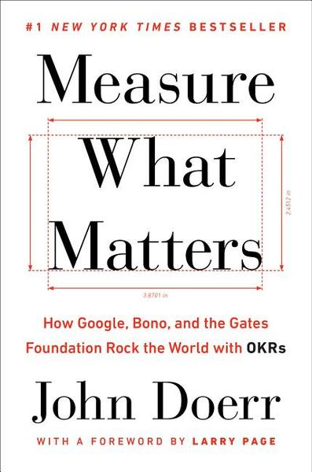

<figure class="float-left" style="width: 240px">
  
  <figcaption>Measure What Matters, OKRs, John Doerr</figcaption>
</figure>

## Summary

Objectives and Key Results (OKRs) have helped many tech companies to move through the initial implementation of their idea and product to big growth and success by developing a repeatable pattern and structure which drives success.

By nature, OKRs encourage principles which you will often find in successful companies.
Focus of the teams, alignment and transparency about what needs to be executed and how, accountability of teams and people who are given room to take initiative, and a stretch state of mind to always crave for bigger results and achievements.

The ideas behind OKRs, or at least the way they are presented in the book matches also very well the recent best practices of management like high frequency feedback and genuine conversation to identify issues and acknowledge success as fast as possible, rather than wait for some kind of annual performance review.

## Detailed Summary

### High-Level Goal of OKRs

To make the goals clear to everyone and help coordinate and unify the entire organization.
It will help organizing efforts from various independent teams and direct them in the same direction.
Well defined, challenging goals that people feel in control of and relate to should increase productivity, motivation and satisfaction.

### Definitions of Good OKRs

#### Objectives

They need to be set to struck a balance between concrete and inspirational and be meaningful and actionable.
They set the direction of the company or team.

Don't confuse high level Objectives with the mission of the company.
Of course they will derive from it, but they should be more applicable so the Key Results can naturally come from the Objectives.
They also are likely to be more short term and practical.

#### Key Results

They need to be time constraint, and to strike a balance between ambitious and realistic.
Above all, they should be measurable and verifiable.
They don't contain judgment, just factual goals to be compared with reality after the time defined.

They should be set frequently (typically monthly or quarterly), be public and transparent, come from people who will have to work with them and reach them (bottom-up), not linked to compensation.

Key results can be modified or changed in the middle of a cycle if the context has changed or some factors drive a change in priorities.

It can be useful to have some "quality" key results in order to control one "quantity" one is reached in the right way or in a sustainable way.
These "quality" ones might still be quantitative, but they are not necessarily ambitious compared to the one they control, it is just to stay in check within a coherent strategy.

### Origins of the Concept

In 1954, Peter Drucker codified "management by objectives and self-control" in _The Practice of Management_.
He was trying to build an alternative to the Taylor-Ford model based on the basis that _"a corporation should be a community built on trust and respect for the workers, not just a profit machine"_

Dr Andy Grove built on top of that in Intel in the 1970s where he developed Management By Objectives (MBO) which is considered as one of the main organizational reasons for the company's huge success.

From there, John Doer learnt the concept that he took to a number of other startups and various organizations he advised over time, leading to a wide adoption of the OKRs.

### What OKRs Bring

#### Focus

The few clearly defined objectives and key results for any given time period are the main guidance for the team.
Any new idea or initiative can be weighted by its impact on the OKRs and prioritize accordingly, the most impactful and important things will get done first, and then the others.
The challenging nature of OKRs should also drive people's imagination and creativity towards ideas to try to reach the defined key results.

> Cristos Goodrow: Engineers struggle with goal setting in two big ways. They hate crossing off anything they think is a good idea, and they habitually underestimate  how long it take to get things done.

#### Alignment & Transparency

The small number of goals and the availability of everyone's specific goals helps making sure everyone is going in the same direction.
If someone is focusing on something which doesn't have an obvious link to an OKR, they would be called out and probably are focusing on the wrong things.
Having your goals connected to higher up OKRs can also help connect between apparently independent teams as you will see your are pushing toward the same goal and so have all interest helping each other.

#### Accountability

If you go to the individual level of OKRs, everyone is in full control of the achievement of the OKRs, there is no way to hide being the fact that maybe someone else in the team failed.
Then if achieving all the individual OKRs of the team members will automatically lead to achieving the OKRs of the team is a slightly different discussion, but that is the one you should have when defining all of these.

The constant tracking of OKRs should also help to see which changes are impacting actually causing in impact rather than relying on previsions of impact.

At the end of a cycle, the OKR can be graded to help improve the definition of future ones.

#### Stretch & Ambition

As OKRs define your goals, they should be set high, otherwise you are quite unlikely to achieve high-performance.

> John Doer: There is no one magic number for the "right" stretch. But consider this: How can your team create maximum value? What would amazing look like?

On the other hand, when objective seem to high, people might tend to set conservative KRs.
You need to make sure to contextualize and make everyone understand why the aim is high.

In some cases, it can also be helpful to actually have rather "regular" goals, Google call it "committed" goals.
They are necessary thing to achieve, and should be recognize as achievements, but maybe they are not as challenging as some "stretch" goals.

### How to do OKRs

#### Introducing OKRs

Start by defining the company's current Objective and Key Results.
You don't have to change it every period, but if you never change it, probably something is wrong.

From this central objective, the higher levels of the company can define their own objectives and matching key results and it can cascade down to all teams and employees.
Note that the cascading here is not about setting the goals of the level below you, but they should set their goals knowing about the level above them so they can understand where is everything going; and the level above should validate that the fulfillment of the goals from below will lead to the fulfillment of their goals.
This top-bottom approach is also a good way to show the commitment to the system as seeing your manager focused on his OKRs is likely to encourage you to define some and focus on achieving them.

#### Evaluating OKRs

The simplest, cleanest way to score an objective is by averaging the percentage completion rates of its associated key results.
Google uses a scale of 0 to 1.

- 0.7 to 1 = Green = We delivered
- 0.4 to 0.6 = Yellow = We made progress, but fell short of completion.
- 0 to 0.3 = Red = We failed to make real progress.

These numbers are to put in context of how much of a stretch the objective was.
If it was more of an incremental one, anything short of 1 can be legit to consider as failure.
In some context it might make sense to get rid of the yellow option to define stricter boundaries.

For any given goal in a given quarter, there maybe be extenuating circumstances.
A weak showing by the number might hide a strong effort; a strong one could be artificially inflated.

> Andy Grove (iOPEC seminar, 1992): You know, in our business we have to set ourselves uncomfortable tough objectives, and then we have to meet them. And then after ten milliseconds of celebration we have to set ourselves another [set of] highly difficult-to-reach objectives and we have to meet them. And the reward of having met one of these challenging goals is that you get to play again.

### What to Value

In accordance to the goal orientation of OKRs, the importance of someone would not be based on their theoretical knowledge, but by how much they accomplish with this knowledge.

Following the same idea, the goal is to increase the output of people, teams and eventually the company, not to be confused with their activity.
It is quite commonly agreed in "thinking" or "creative" jobs that the increase of activity is not necessarily leading to an increase in output and even less a linear one.

#### People are at the core of OKRs

OKRs should not be used for evaluating people, as it would likely impact negatively how they are set.
Someone setting ambitious OKRs should not be rewarded, even if meeting them only partially, more than someone meeting fully a lazily set one.

Moreover, a failure in achieving an OKR by definition means it's too late to achieve it and to make the desired impact for the company, it is beneficial for everyone to identify issuers earlier on so they can be fixed and the OKR at least partially completed.

Performance management should then be much more continuous. It can be implemented with an instrument called CFRs

- Conversations: an authentic, richly textured exchange between manager and contributor, aimed at driving performance.
- Feedback: bidirectional or networked communication among peers to evaluate progress and guide future improvement.
- Recognition: expressions of appreciation to deserving individuals for contributions of all sizes.

It should help identify issues and fix them as soon as possible as well as helping everyone to feel the value they are bringing to the company and others.

#### How OKRs can impact the culture and vice versa

Culture and OKRs are quite strongly related, they nurture each other.
The proper culture embraced by all employees can help to achieve OKRs, as well as OKRs can help define a highly-performing culture within an organization.

> Dov Seidman: What we choose to measure is a window into our values, and into what we value

Project Aristotle, an internal Google study of 180 teams, standout performance correlated to affirmative responses to these five questions:

1. Structure and clarity: Are goals, roles, and execution plans on our team clear?
2. Psychological safety: Can we take risks on this team without feeling insecure or embarrassed?
3. Meaning of work: Are we working on something that is personally important for each of us?
4. Dependability: Can we count on each other to do high-quality work on time?
5. Impact of work: Do we fundamentally believe that the work we're doing matters?
