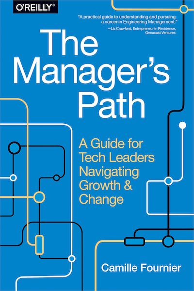

<figure class="float-left" style="width: 240px">
  
  <figcaption>The Manager's Path, Camille Fournier</figcaption>
</figure>

## Summary

Each chapter addresses independently a specific part of someone's career in tech evolving from an individual contributor through manager positions up to a CTO job. You can easily just refer to the part which feel relevant to you at this specific moment in your career.

## Detailed Summary

### Management principles

Blu

### Everyone can behave like a manager: Manage Yourself

As an individual contributor, your experience can vary broadly.
Your day to day job is likely to be quite different base on your experience in the industry.

Though, at any level, you can find opportunities to show demonstrate some skills which would make you an ideal candidate for more responsibilities.

- Come with potential solutions to your problems rather than just stating your problems in your 1 to 1.
- Show some interest and engage about topics slightly broader than your specific defined area or responsibilities.
  For example do show interest in meeting about the upcoming projects, and ideas about what to do next for your team.
- Don't think only about your own problems or things to improve but also at the team level, what seems to be working well or not.

### Experiment with management: Mentoring

This is likely to be your first experience with management.
The good thing about it is that it comes with little responsibilities and potentially big results.

As someone with more experience than the mentee both in your work and company, you should be more than enough skilled to guide them through their work in your company and the processes of the company overall.

The main thing you can do wrong with it is overcommit.
It will lead to the mentee feeling neglected and having a bad experience.

It is also important to be clear about the situation and expected outcomes.

- Are you mentoring an intern? a new joiner?
- How much experience do they have? are they just out of uni or even still studying?
- Is the goal mainly to have then stay in the company in a productive way or learn while having a good time and building a network so they become an ambassador for your company.

It is a great opportunities to demonstrate some more specific skills needed in management rather than broad interest.

- *Listening* to your mentee should be a key part.
  As a junior recent joiner, they will have a lot of question and less knowledge, it will be key to understand their main question in order to answer in a way they will understand.
- Use this experience as an opportunity to *question* any status quo through the fresh vision of the mentee *with an open mind*.
  They are likely coming with a different background and understanding of how things should work.
  They even are probably still idealistic if early in their career.
  So do question why aren't things ideal? And couldn't they be a bit closer to this?

### Learn how to manage a project: Tech Lead

??

- Understand that *time saved to other people is almost always more valuable than your own time*.
  This applies as well on quick questions answered to unblock someone as one the time spent on planning a project ahead so it can be executed smoothly.
- 

### Managing people

### Managing a team

### Employees traits and how likely they are to perform as managers

Obviously the following should not be generalized beyond some point and is mostly intended to make you double check the potential negative points with an employee you think would have traits matching those of a given type.

| Type Name                 | Traits                             |Good at                             | (Usually) Bad at                   |
|---------------------------|------------------------------------|------------------------------------|------------------------------------|
| The Alpha Geek            |                                    |                                    |                                    |
| The Process Czar          |                                    |                                    |                                    |
| Micromanager              |                                    |                                    |                                    |

### Quotes

- Your Highlight on page 136 | location 2083-2084 | Added on Monday, 9 September 2019 07:49:49

generally one of them. However, I have found the ideas in David Allen’s book Getting Things Done1

- Your Highlight on page 163 | location 2495-2496 | Added on Tuesday, 17 September 2019 07:25:18

Laziness and impatience. We focus so we can go home, and we encourage going home because it forces us to constantly focus. This is how great teams scale.

- Your Highlight on page 164 | location 2514-2516 | Added on Tuesday, 17 September 2019 07:26:56

David Allen, Getting Things Done: The Art of Stress-Free Productivity (New York: Penguin, 2001). 2

- Your Highlight on page 170 | location 2598-2599 | Added on Wednesday, 18 September 2019 07:27:32

Some suggested prompts to provide the person you are holding the skip-level 1-1 with include:

- Your Highlight on page 241 | location 3694-3694 | Added on Sunday, 29 September 2019 21:54:00

“I’m sorry, I did not listen to you and I know

- Your Highlight on page 256 | location 3916-3920 | Added on Tuesday, 1 October 2019 07:48:32

fact, there’s even a law that accounts for this, from John Gall’s book Systemantics:1 A complex system that works is invariably found to have evolved from a simple system that worked. A complex system designed from scratch never works and cannot be patched up to make it work. You have to start over with a working simple system.

- Your Highlight on page 265 | location 4056-4057 | Added on Wednesday, 2 October 2019 07:32:25

over their level. I then spent some time talking about John Allspaw’s blog post “On Being a Senior Engineer”

- Your Highlight on page 284 | location 4340-4342 | Added on Friday, 4 October 2019 07:34:11

Some of my favorite resources include the podcasts on tarabrach.com and the writings of Pema Chödrön.