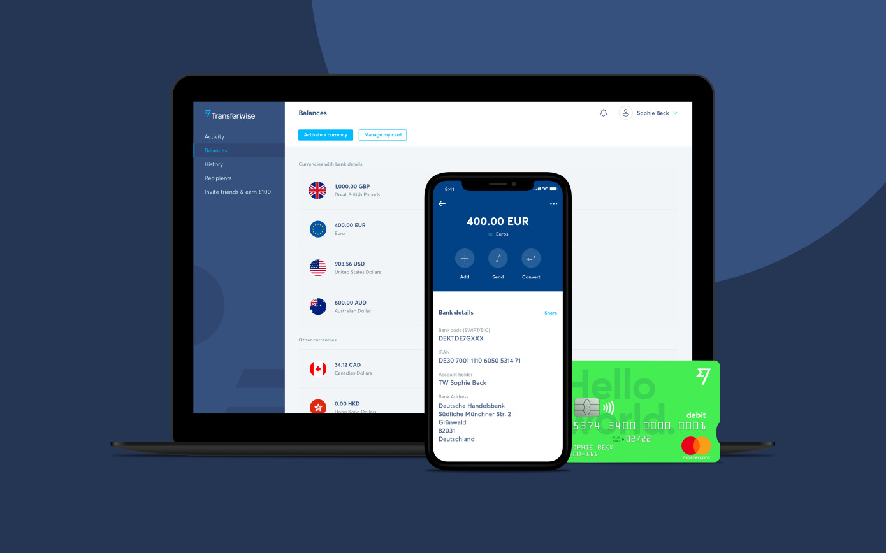

I am currently a full-stack software engineer at TransferWise in a team working on the borderless account opened to the public in May 2017. The debit Mastercard® currently in beta testing is soon to be open to the public.

In the team we work following a Domain Driven Design approach to build flexible, realistic, maintanable and easy to make evolve software. Over the near 2 years I have spent in the team that has enabled us to have one of the most stable service in the company while keeping a fast pace of itearation.

This is needed as the domain managed by the team plays a key role in the borderless account product.

If you want to take part of it, <a href="https://transferwise.com/jobs/position/971107-full-stack-developer-borderless-accounts" target="_blank">we're hiring!</a>

## Professional Experience

## Education

## Interests
