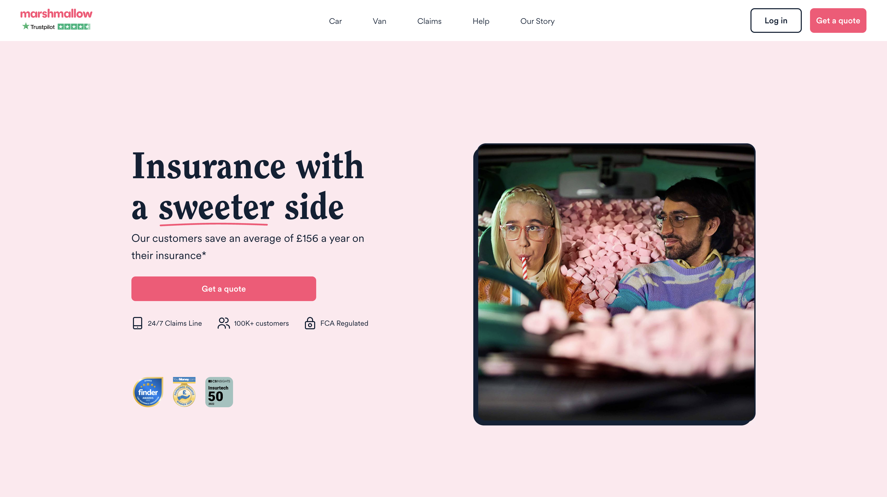

I am currently a backend engineer at Marshmallow.

We are working on providing expats a car insurance which takes into account their driving experience wherever it was and not only in the UK as other insurers usually do. If you're a foreign driver in the United Kingdom, [check our quote](https://www.marshmallow.com/car-insurance-quote/start-quote), you might be interested!

Longer term we want to allow people to get fairer access to insurance and financial services, and there is still a lot to do to see some meaningful change there!
If you want to take part of it, [we're hiring!](https://www.marshmallow.com/jobs)

## Professional Experience
### TransferWise - Software Engineer - Tallin (Estonia) & London (United Kingdom)
From July 2016 to now.

### Morgan Stanley - Technology Summer Analyst - London (United Kingdom)

## Education
### Grenoble INP, Ensimag - Grenoble (France)

### National University of Singapore (NUS) - Singapore (Singapore)

## Interests
### Domain Driven Design

###
